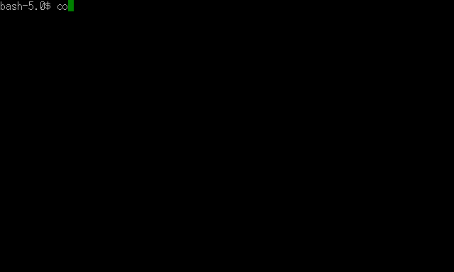
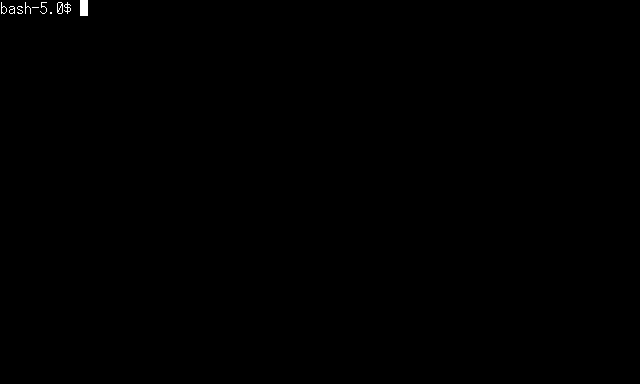

# cassete-deck

Record terminal commands into a GIF file.

**⚠️ This is still just a MVP/technical demo/etc. Most features are not implemented/tested. Use cautiously.** 


This project was inspired by [VHS](https://github.com/charmbracelet/vhs).

VHS requires `ffmpeg` and `chromium` to record terminal emulator GIFs.
Both terminals and GIFs were invented **many** years ago, and are
really simple and stupid.
While using modern technologies to work with them is alright,
it's not efficient to use millions SLOCs of `chromium` and `ffmpeg`
for such a simple tasks.

The aim of this project is to recreate core of VHS with minimal dependencies.
`cassete-deck` built with 2 pieces of software:

* [lecram/gifenc](https://github.com/lecram/gifenc) to write GIF files;
* [uobikiemukot/yaft](https://github.com/uobikiemukot/yaft) used as a simple terminal emulator implementation:
    * This project is essentially a fork of [yaft](https://github.com/uobikiemukot/yaft) with GIF backend and `.tape` player.

Such utility may be usefull to enrich documentation with animated GIFs which illustrate
usage of CLI programs.



## Prior art

Of course, there's a lot of similar projects, like:

* [VHS](https://github.com/charmbracelet/vhs):
    * depends on chromium and ffmpeg.
* [uobikiemukot/recterm](https://github.com/uobikiemukot/recterm):
    * implementation by the author of [yaft](https://github.com/uobikiemukot/yaft);
    * was not designed to execute commands from file.
* [asciinema](https://github.com/asciinema/asciinema):
    * records terminal to upload and replay it in browser;
    * was not designed to execute commands from file.
* [lecram/config](https://github.com/lecram/congif):
    * renders `script` recordings as GIFs.
* [script and scriptreplay](https://man7.org/linux/man-pages/man1/scriptreplay.1.html):
    * GNU utility to record and replay terminal sessions.

If you know any other interesting utilities for recording terminal emulators, feel free
to update this list via pull request or issue.

## Build

Clone this repo with submodules, build using cmake 3.0+ and C/CPP compiler
with C++17 support:


## Usage

CLI usage:

```sh
./build/cassette_deck ./demo/hello.tape.gif
```

## Tape reference

See examples in `./examples`.
Commands are modelled after [VHS's ones](https://github.com/charmbracelet/vhs#vhs-command-reference)
and should be almost compatible.

There's one command that is not implemented in VHS:
```
TYPE start_long_running_process
ENTER
AWAIT
```

`AWAIT` commands pauses tape playback until last command is complete.
This is implemented by sending `SIGUSR1` from controlled shell via
`PROMPT_COMMAND` environment variable.


## TODO

* headless mode without X11 dependency;
* more commands from VHS, compatibility with VHS tapes;
* themes;
* CI, CI actions;
* padding, decorations.
